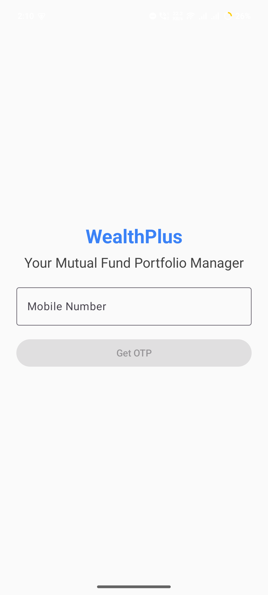
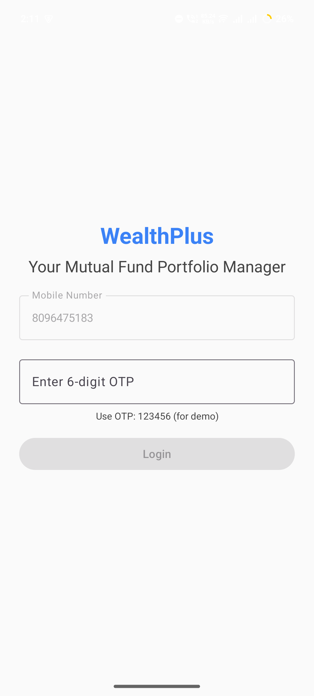
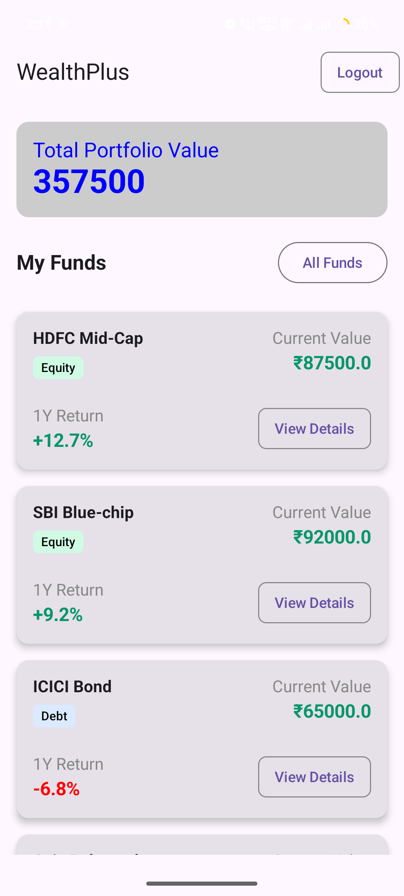

#  WealthPlusApp – Kotlin Compose Multiplatform App

A mini cross-platform mutual fund portfolio app built using **Kotlin Compose Multiplatform** with shared **UI**, **business logic**, and **ViewModels** for both **Android** and **iOS**.

> 🔗 Built from scratch using [Kotlin Multiplatform Wizard](https://kmp.jetbrains.com/?android=true&ios=true&iosui=compose&includeTests=true)

---

## 📱 Features

### Core
-  **Login + OTP Verification** (Dummy OTP: `123456`)
-  **Dashboard** with 5 dummy mutual funds
-  **Portfolio Value Summary**
-  **Filter** by Equity / Debt / Hybrid / All

###  UI
- Shared **Jetpack Compose UI**
- Fully responsive layouts
- Color-coded fund types
- Android & iOS compatible
- “Verifying...” login feedback
- “View Details” button (non-functional demo)
- Loading indicator while fetching data

---

##  Tech Stack

| Layer        | Technology                         |
|--------------|-------------------------------------|
| UI           | Kotlin **Compose Multiplatform**    |
| State        | Kotlin Coroutines + StateFlow       |
| Shared Logic | Kotlin Multiplatform (KMM)          |
| Persistence  | Multiplatform Settings              |
| Navigation   | Jetpack Compose Navigation          |
| Architecture | Clean: data / domain / presentation |

---

## 🛠 Project Structure

This is a Kotlin Multiplatform project targeting Android, iOS.

* `/composeApp` is for code that will be shared across your Compose Multiplatform applications.
  It contains several subfolders:
  - `commonMain` is for code that’s common for all targets.
  - Other folders are for Kotlin code that will be compiled for only the platform indicated in the folder name.
    For example, if you want to use Apple’s CoreCrypto for the iOS part of your Kotlin app,
    `iosMain` would be the right folder for such calls.

* `/iosApp` contains iOS applications. Even if you’re sharing your UI with Compose Multiplatform,
  you need this entry point for your iOS app. This is also where you should add SwiftUI code for your project.

WealthPlusApp/
├── androidApp/ # Android app launcher
├── shared/ # Shared code for Android + iOS
│ └── src/commonMain/kotlin/
│ ├── data/ # Session + Dummy API
│ ├── domain/ # Models
│ ├── presentation/ # ViewModels + State
│ └── ui/ # Shared Compose screens

---

##  Running the Project

###  Android (Windows/macOS/Linux)

1. Open the project in **Android Studio**
2. Run `androidApp` → `MainActivity.kt`
3. Build and deploy on emulator or physical device

###  iOS (macOS only)

1. Open `iosApp/` in **Xcode 15+**
2. Add SwiftUI launcher to wrap `ComposeViewController()`
3. Run on iOS simulator or device

>  Shared UI is ready — only iOS wrapper setup is needed.

---

##  Login Info

- Use any valid 10-digit mobile number (e.g. `9876543210`)
- OTP: `123456`

---

## 📸 Screenshots (Android)

---

##  Author

**Dinakaran** – Android Developer with KMM focus

---